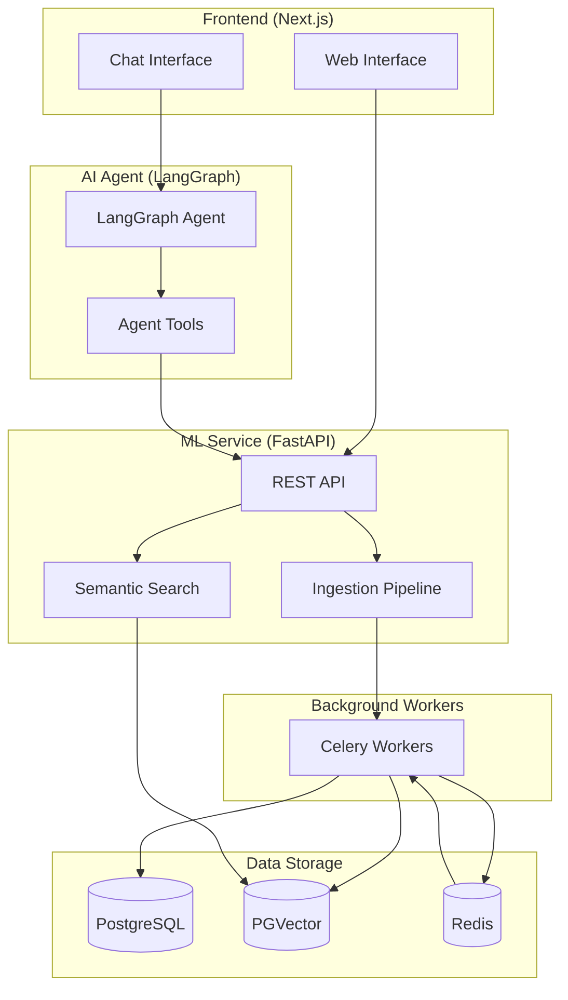
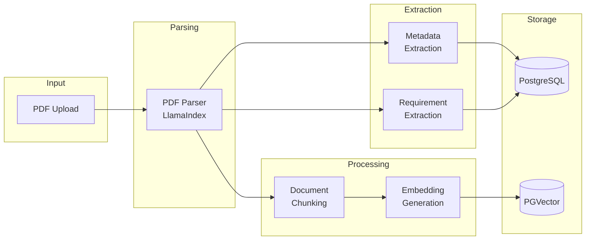

# AI Tender Assistant

> 💡 **Note:** This README contains Mermaid diagrams. For the best viewing experience, install a Mermaid extension for your editor or view this file on GitHub which renders Mermaid diagrams automatically.

An intelligent document processing system for tender requirement extraction and analysis. This application automatically extracts, categorizes, and manages requirements from tender documents using AI-powered analysis.

## Overview

AI Tender Assistant streamlines the tender analysis process by:

- **Automated Document Ingestion** - Upload PDF tender documents for automatic processing
- **Intelligent Requirement Extraction** - AI extracts all requirements with categories, classifications, and page numbers
- **Semantic Search** - Query your document library using natural language
- **Conversational Interface** - Chat with an AI agent that understands your tender documents
- **Export Capabilities** - Export requirements to CSV or JSON for further analysis

## Architecture



## Ingestion Pipeline



### Pipeline Steps

1. **PDF Parsing** - Documents are parsed using LlamaIndex's SimpleDirectoryReader, extracting text content with page tracking
2. **Metadata Extraction** - AI extracts document title, author, tender reference, submission deadline, and key topics
3. **Requirement Extraction** - AI identifies and categorizes all requirements with:
   - Requirement category (Equipment Specification, Timeline, Compliance, etc.)
   - Classification (Mandatory/Optional)
   - Compliance status tracking
   - Source page number for traceability
4. **Document Chunking** - Content is split into semantic chunks using LlamaIndex's SentenceSplitter
5. **Embedding Generation** - OpenAI embeddings are generated for semantic search capabilities
6. **Vector Storage** - Embeddings are stored in PostgreSQL with PGVector for similarity search

## Technology Stack

### Frontend
- **Next.js 16** - React framework with App Router
- **Tailwind CSS** - Utility-first CSS framework
- **TypeScript** - Type-safe JavaScript

### AI & ML
- **LlamaIndex** - Document processing, chunking, and embedding framework
- **LangGraph** - Agent orchestration and state management
- **OpenAI GPT-4** - Language model for extraction and chat

### Backend Services
- **FastAPI** - High-performance Python API framework
- **Celery** - Distributed task queue for background processing
- **Redis** - Message broker and caching

### Database
- **PostgreSQL 16** - Primary database with PGVector extension
- **PGVector** - Vector similarity search for semantic queries

## Prerequisites

Before setting up the project, ensure you have the following installed:

- **Docker** and **Docker Compose** - For running containerized services
- **Node.js 18+** - For the frontend and agent
- **npm** (or pnpm/yarn) - Package manager
- **Python 3.11+** - For the LangGraph agent

You will also need:
- **OpenAI API Key** - For AI-powered features

## Setup

### 1. Clone the Repository

```bash
git clone <repository-url>
cd ai-tender-assistant
```

### 2. Configure Environment Variables

Create the required environment files:

```bash
# Agent environment
cat > agent/.env << EOF
OPENAI_API_KEY=your-openai-api-key-here
EOF

# ML Service environment (used by Docker)
cat > .env << EOF
POSTGRES_USER=enest
POSTGRES_PASSWORD=enest_secure_password
POSTGRES_DB=enest_ml
OPENAI_API_KEY=your-openai-api-key-here
EOF
```

### 3. Install Dependencies

```bash
npm install
```

This will also install Python dependencies for the LangGraph agent.

### 4. Start the Application

```bash
npm run dev
```

This command will:
1. Build and start Docker containers (PostgreSQL, Redis, ML Service, Celery)
2. Start the Next.js frontend on `http://localhost:3000`
3. Start the LangGraph agent on `http://localhost:8123`

### 5. Access the Application

Open your browser and navigate to:
- **Home Page**: `http://localhost:3000`
- **Document Upload**: `http://localhost:3000/ingest`
- **Document Library**: `http://localhost:3000/documents`
- **ML Service API**: `http://localhost:8000/docs`

## Available Scripts

| Script | Description |
|--------|-------------|
| `npm run dev` | Start all services (Docker + UI + Agent) |
| `npm run dev:local` | Start only UI and Agent (no Docker) |
| `npm run dev:ui` | Start only the Next.js UI |
| `npm run dev:agent` | Start only the LangGraph agent |
| `npm run docker:up` | Start Docker containers |
| `npm run docker:down` | Stop Docker containers |
| `npm run docker:logs` | View Docker container logs |
| `npm run build` | Build for production |
| `npm run lint` | Run ESLint |

## Project Structure

```
enest-agent/
├── agent/                  # LangGraph AI agent
│   ├── main.py            # Agent definition and tools
│   └── pyproject.toml     # Python dependencies
├── ml_service/            # FastAPI ML service
│   ├── api/               # API routes
│   ├── core/              # Ingestion pipeline
│   ├── db/                # Database models and repositories
│   ├── schemas/           # Pydantic schemas
│   └── tasks/             # Celery background tasks
├── src/                   # Next.js frontend
│   ├── app/               # App Router pages
│   └── components/        # React components
├── docker-compose.yml     # Docker services configuration
└── package.json           # Node.js dependencies
```

## API Endpoints

### Document Management
- `POST /api/v1/ingest` - Upload and process a tender document
- `GET /api/v1/jobs/{job_id}` - Check ingestion job status
- `GET /api/v1/documents` - List all ingested documents
- `GET /api/v1/documents/{job_id}` - Get document details

### Search
- `POST /api/v1/search` - Semantic search across documents

### Export
- `GET /api/v1/documents/export/requirements/csv` - Export all requirements as CSV
- `GET /api/v1/documents/export/requirements/json` - Export all requirements as JSON

## Troubleshooting

### Docker Issues
If containers fail to start:
```bash
# Check container logs
npm run docker:logs

# Restart containers with fresh volumes
docker-compose down -v
npm run docker:up
```

### Agent Connection Issues
If the chat agent can't connect to tools:
1. Ensure Docker containers are running: `docker ps`
2. Check ML service health: `curl http://localhost:8000/health`
3. Verify OpenAI API key is set correctly

### Database Issues
If you encounter database errors after schema changes:
```bash
# Reset the database (WARNING: This deletes all data)
docker-compose down -v
npm run docker:up
```

## License

This project is licensed under a **Non-Commercial License**.

- ✅ **Allowed**: Personal use, educational purposes, student projects, open source projects
- ❌ **Not Allowed**: Commercial use without permission

For commercial licensing inquiries, please contact: **abdelsalam.h.a.a@gmail.com**

See the [LICENSE](LICENSE) file for full details.
